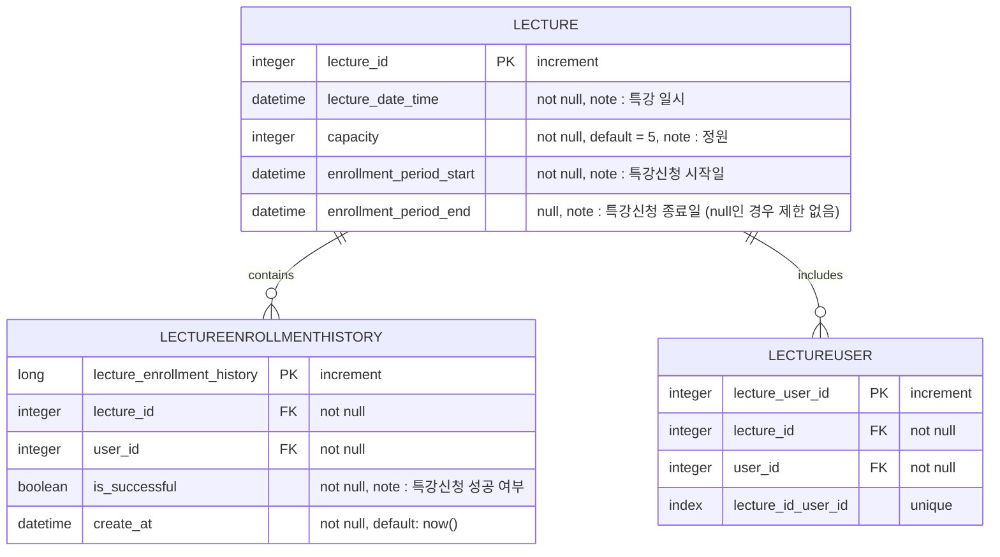
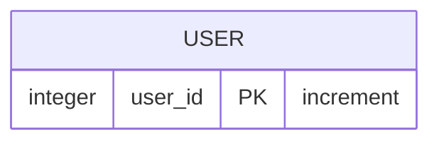

## API Specs
1️⃣ **(핵심)** 특강 신청 **API `POST /lectures/apply`**

- 특정 userId 로 선착순으로 제공되는 특강을 신청하는 API 를 작성합니다.
- 동일한 신청자는 한 번의 수강 신청만 성공할 수 있습니다.
- 각 강의는 선착순 30명만 신청 가능합니다.
- 이미 신청자가 30명이 초과되면 이후 신청자는 요청을 실패합니다.
- 어떤 유저가 특강을 신청했는지 히스토리를 저장해야한다.

**2️⃣ (기본) 특강 목록 API `GET /lectures`**

- 단 한번의 특강을 위한 것이 아닌 날짜별로 특강이 존재할 수 있는 범용적인 서비스로 변화시켜 봅니다.
- 이를 수용하기 위해, 특강 엔티티의 경우 기본 과제 SPEC 을 만족하는 설계에서 변경되어야 할 수 있습니다.
    - 수강신청 API 요청 및 응답 또한 이를 잘 수용할 수 있는 구조로 변경되어야 할 것입니다.
- 특강의 정원은 30명으로 고정이며, 사용자는 각 특강에 신청하기전 목록을 조회해볼 수 있어야 합니다.
    - 추가로 정원이 특강마다 다르다면 어떻게 처리할것인가..? 고민해 보셔라~

3️⃣ **(기본)** 특강 신청 완료 여부 조회 API **`GET /lectures/application/{userId}`**

- 특정 userId 로 특강 신청 완료 여부를 조회하는 API 를 작성합니다.
- 특강 신청에 성공한 사용자는 성공했음을, 특강 등록자 명단에 없는 사용자는 실패했음을 반환합니다. (true, false)

## ERD
### Lecture

### User

## 